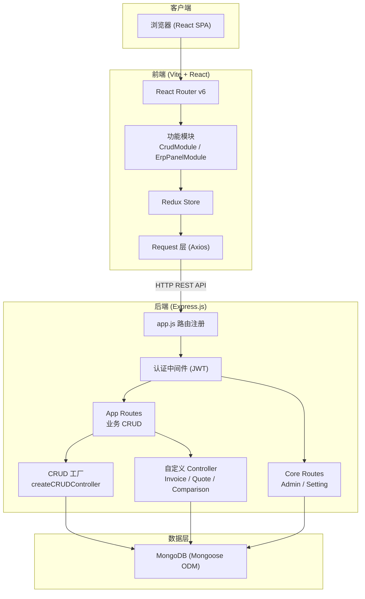
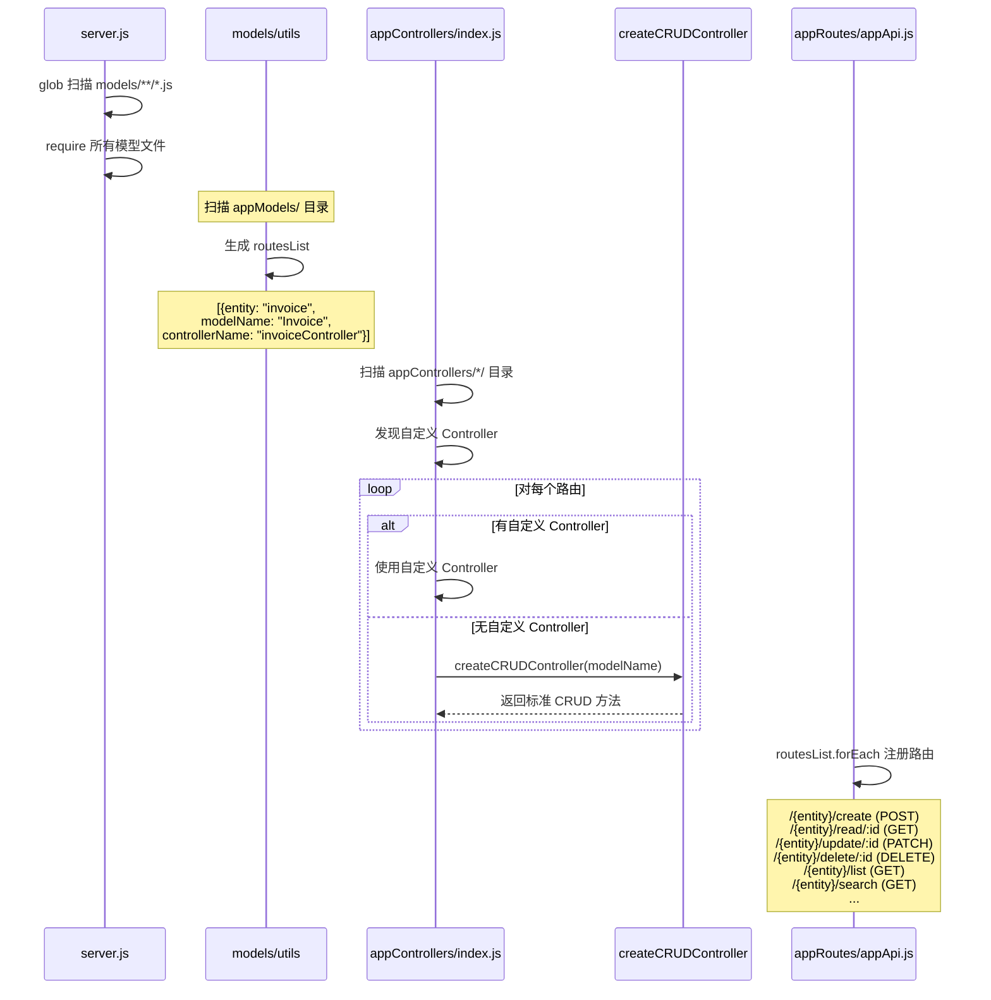
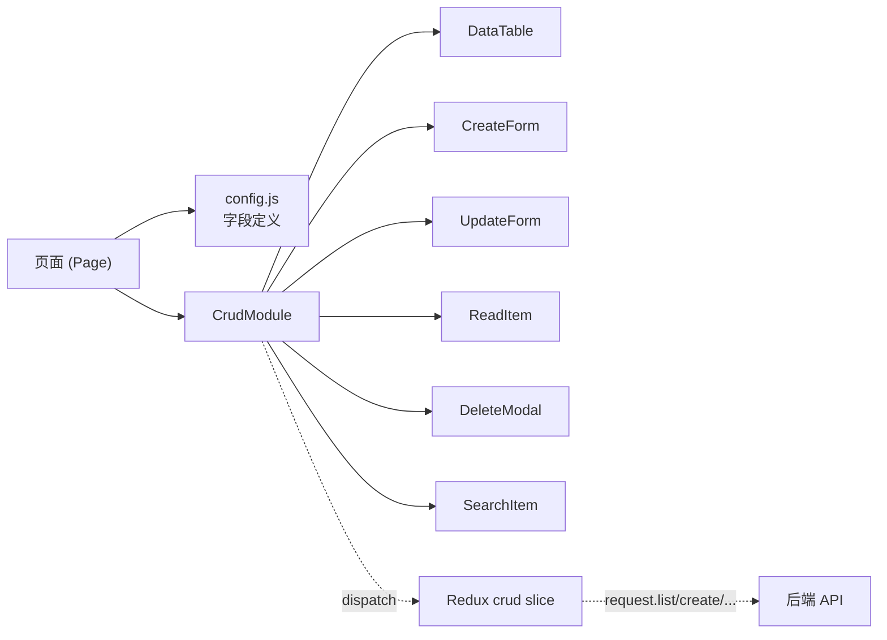
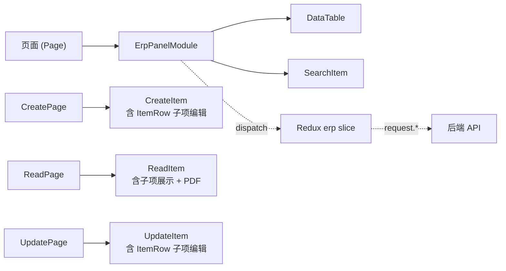
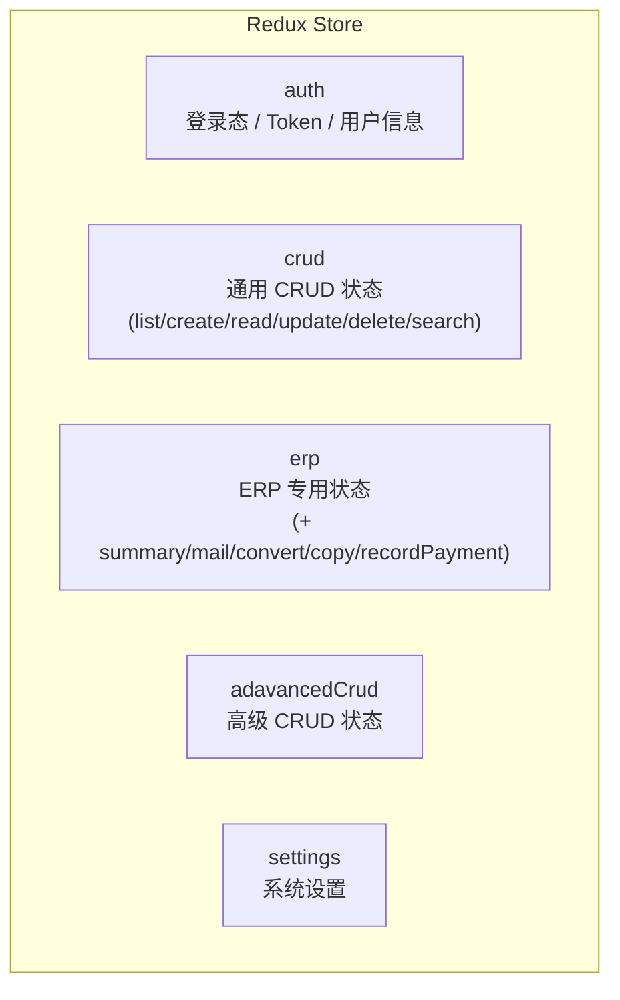
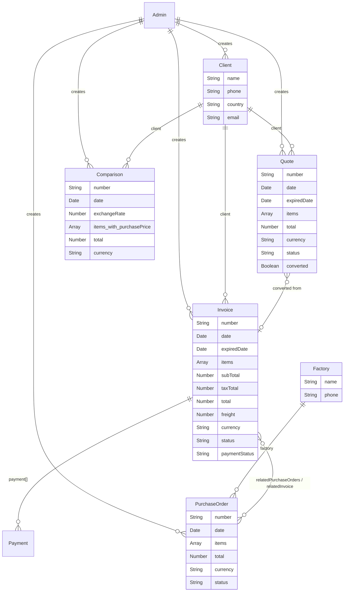

# Ola ERP/CRM 代码库架构审查报告

> **审查日期**: 2026-03-26  
> **审查人**: Antigravity AI  
> **代码库**: `SeekMi-Technologies/crm` (基于 [idurar-erp-crm](https://github.com/idurar/idurar-erp-crm) 魔改)  
> **技术栈**: Node.js + Express + MongoDB (后端) | React + Vite + Ant Design + Redux Toolkit (前端)

---

## 目录

1. [整体架构概览](#1-整体架构概览)
2. [后端架构详解](#2-后端架构详解)
3. [前端架构详解](#3-前端架构详解)
4. [数据模型关系图](#4-数据模型关系图)
5. [模块化开发指南（面向前端同学）](#5-模块化开发指南面向前端同学)
6. [Ola 定制化模块清单](#6-ola-定制化模块清单)
7. [技术债务与改进建议](#7-技术债务与改进建议)

---

## 1. 整体架构概览



### 核心设计原则

| 原则 | 说明 |
|------|------|
| **Model-Driven 自动发现** | 后端通过 glob 扫描 `appModels/` 目录，自动注册模型、生成 CRUD 路由与控制器 |
| **Core / App 分层** | `core` 负责系统级功能（认证、设置、管理员），`app` 负责业务功能（发票、报价、采购单） |
| **CRUD Factory 模式** | 通用 CRUD 操作由工厂函数自动生成，自定义控制器可选择性覆盖 |
| **Config-Driven 前端** | 前端模块通过 `config` 对象驱动 UI 渲染，实现声明式开发 |

---

## 2. 后端架构详解

### 2.1 目录结构

```
backend/src/
├── app.js                          # Express 应用配置 & 路由注册
├── server.js                       # 启动入口, MongoDB 连接, 模型加载
├── controllers/
│   ├── coreControllers/            # 系统级控制器
│   │   ├── adminAuth/              # JWT 认证 (login/logout/token验证)
│   │   ├── adminController/        # 管理员 CRUD
│   │   └── settingController/      # 系统设置管理
│   ├── appControllers/             # 业务控制器
│   │   ├── index.js                # ★ 控制器注册中心 (自动发现)
│   │   ├── invoiceController/      # 发票 (自定义覆盖)
│   │   ├── quoteController/        # 报价单 (自定义覆盖)
│   │   ├── comparisonController/   # 比价单 (Ola新增)
│   │   ├── priceSearchController/  # 价格搜索 (Ola新增)
│   │   └── ...其他Controller/
│   ├── middlewaresControllers/
│   │   ├── createCRUDController/   # ★ CRUD 工厂模式核心
│   │   ├── createAuthMiddleware/   # 认证中间件工厂
│   │   └── createUserController/   # 用户控制器工厂
│   ├── pdfController/              # PDF 生成
│   └── excelController/            # Excel 导出
├── models/
│   ├── appModels/                  # ★ 业务模型 (自动扫描注册)
│   │   ├── Invoice.js, Quote.js, PurchaseOrder.js
│   │   ├── Client.js, Factory.js, Merch.js
│   │   ├── Comparison.js, Payment.js, Currencies.js
│   │   └── PaymentMode.js, Taxes.js
│   ├── coreModels/                 # 系统模型
│   │   ├── Admin.js, AdminPassword.js
│   │   ├── Setting.js, Upload.js
│   └── utils/index.js              # ★ 模型自动发现 & 路由映射
├── routes/
│   ├── appRoutes/appApi.js         # ★ 业务路由 (自动生成 + 手动扩展)
│   ├── coreRoutes/                 # 系统路由
│   └── exportRoutes.js             # Excel 导出路由
├── middlewares/                    # 中间件 (文件上传、库存等)
├── handlers/                       # 错误处理 & 下载处理
├── settings/                       # 系统初始化设置
├── setup/                          # 数据库初始化脚本
└── utils/                          # 工具函数
```

### 2.2 ★ CRUD 工厂模式（核心设计模式）

这是整个后端最重要的设计模式。理解它，就理解了整个系统的运作方式。

#### 工作流程



#### 关键代码解析

**Step 1: 模型自动发现** — [models/utils/index.js](file:///Users/duke/Documents/GitHub/crm/backend/src/models/utils/index.js)

```javascript
// 扫描 appModels/ 目录下的所有 .js 文件
const appModelsFiles = globSync('./src/models/appModels/**/*.js');

// 对每个模型文件生成路由映射
// 例如: Client.js → { entity: "client", modelName: "Client", controllerName: "clientController" }
```

> [!IMPORTANT]
> **添加新业务实体只需要 3 步**:
> 1. 在 `appModels/` 新建模型文件（如 `Supplier.js`）
> 2. 系统自动生成 CRUD 路由: `/api/supplier/create|read|update|delete|list|search`
> 3. 如需自定义逻辑，在 `appControllers/` 创建 `supplierController/` 目录

**Step 2: CRUD 工厂** — [createCRUDController/index.js](file:///Users/duke/Documents/GitHub/crm/backend/src/controllers/middlewaresControllers/createCRUDController/index.js)

```javascript
const createCRUDController = (modelName) => {
  const Model = mongoose.model(modelName);
  return {
    create: (req, res) => create(Model, req, res),
    read:   (req, res) => read(Model, req, res),
    update: (req, res) => update(Model, req, res),
    delete: (req, res) => remove(Model, req, res),
    list:   (req, res) => paginatedList(Model, req, res),
    // ... search, filter, summary, listAll
  };
};
```

**Step 3: 自定义覆盖** — 以 [invoiceController/index.js](file:///Users/duke/Documents/GitHub/crm/backend/src/controllers/appControllers/invoiceController/index.js) 为例：

```javascript
// 先生成标准 CRUD
const methods = createCRUDController('Invoice');

// 再用自定义实现覆盖特定方法
methods.create = require('./create');   // 自定义创建逻辑（含编号生成）
methods.update = require('./update');   // 自定义更新逻辑（含金额重算）
methods.mail   = require('./sendMail'); // 新增: 邮件发送
methods.copy   = require('./copy');     // 新增: 复制功能
// ... 未覆盖的方法仍使用工厂默认实现
```

### 2.3 路由层

**路由注册顺序** — [app.js](file:///Users/duke/Documents/GitHub/crm/backend/src/app.js):

```
/api          → coreAuthRouter          (无需认证: login/register/forgot-password)
/api          → [JWT 认证] → coreApiRouter   (需认证: admin/settings)
/api          → [JWT 认证] → erpApiRouter    (需认证: 所有业务实体)
/download     → coreDownloadRouter      (文件下载)
/public       → corePublicRouter        (公开接口)
/export/excel → exportRoutes            (Excel导出, 无需认证⚠️)
```

> [!WARNING]
> Excel 导出路由 `/export/excel` 目前没有认证中间件保护，存在安全风险。

### 2.4 认证机制

- 基于 **JWT (JSON Web Token)** 的认证
- Token 通过 `cookie-parser` 以 HttpOnly Cookie 形式传递
- 认证中间件: [adminAuth/isValidAuthToken.js](file:///Users/duke/Documents/GitHub/crm/backend/src/controllers/coreControllers/adminAuth/isValidAuthToken.js)
- 密码使用 `bcryptjs` 哈希存储

---

## 3. 前端架构详解

### 3.1 目录结构

```
frontend/src/
├── main.jsx                        # 入口文件
├── RootApp.jsx                     # 根组件
├── router/
│   ├── AppRouter.jsx               # 已认证路由容器
│   ├── AuthRouter.jsx              # 未认证路由容器
│   └── routes.jsx                  # ★ 路由定义 (所有页面路由)
├── pages/                          # 页面组件
│   ├── Dashboard.jsx               # 仪表板
│   ├── AskOla.jsx                  # Ola AI 对话 (Ola新增)
│   ├── Customer/                   # 客户管理 (CrudModule 模式)
│   ├── Invoice/                    # 发票管理 (ErpPanel 模式)
│   ├── Quote/                      # 报价单管理
│   ├── PurchaseOrder/              # 采购单管理
│   ├── Comparison/                 # 比价单 (Ola新增)
│   ├── PriceSearch/                # 价格搜索 (Ola新增)
│   └── ...
├── modules/                        # ★ 功能模块 (核心抽象层)
│   ├── CrudModule/                 # 简单 CRUD 模块
│   ├── ErpPanelModule/             # 复杂 ERP 模块 (含子项管理)
│   ├── InvoiceModule/              # 发票专用模块
│   ├── QuoteModule/                # 报价单专用模块
│   ├── POModule/                   # 采购单专用模块
│   ├── ComparisonModule/           # 比价单模块 (Ola新增)
│   ├── PaymentModule/              # 付款模块
│   ├── DashboardModule/            # 仪表板模块
│   └── ...
├── components/                     # 共享组件
│   ├── DataTable/                  # 数据表格
│   ├── CreateForm/                 # 创建表单
│   ├── UpdateForm/                 # 更新表单
│   ├── ReadItem/                   # 详情展示
│   ├── DeleteModal/                # 删除确认
│   ├── SearchItem/                 # 搜索组件
│   ├── SelectAsync/                # 异步下拉选择
│   └── ... (共 27 个)
├── forms/                          # 表单定义
│   ├── CustomerForm.jsx            # 客户表单
│   ├── DynamicForm/                # 动态表单生成器
│   └── ...
├── redux/                          # ★ 状态管理
│   ├── store.js                    # Redux Store 配置
│   ├── rootReducer.js              # Reducer 组合
│   ├── crud/                       # CRUD 通用 Slice
│   ├── erp/                        # ERP 专用 Slice (含 recordPayment, mail, convert, copy)
│   ├── auth/                       # 认证 Slice
│   ├── settings/                   # 设置 Slice
│   └── adavancedCrud/              # 高级 CRUD Slice
├── request/                        # HTTP 请求层
│   ├── request.js                  # ★ Axios 封装 (所有 API 调用)
│   ├── errorHandler.js             # 统一错误处理
│   ├── successHandler.js           # 统一成功处理
│   └── devMockInterceptor.js       # 开发环境 Mock
├── context/                        # React Context
│   ├── crud/                       # CRUD 上下文 (侧边栏控制等)
│   ├── erp/                        # ERP 上下文
│   └── appContext/                 # 全局应用上下文
├── layout/                         # 布局组件
│   ├── DefaultLayout/              # 默认布局 (侧边栏 + 内容区)
│   ├── CrudLayout/                 # CRUD 页面布局
│   ├── ErpLayout/                  # ERP 页面布局
│   └── ...
├── locale/                         # 国际化
├── style/                          # 样式文件
├── config/                         # 配置文件
└── hooks/                          # 自定义 Hooks
```

### 3.2 ★ 两种前端模块模式

前端有两种核心模块模式，理解这两种模式是前端开发的关键：

#### 模式一: CrudModule（简单实体）

适用于: **Customer、Factory、Merchandise、Currencies、Taxes、PaymentMode** 等扁平结构的实体。



**代码示例** — [Customer/index.jsx](file:///Users/duke/Documents/GitHub/crm/frontend/src/pages/Customer/index.jsx):

```jsx
// ① 导入模块和表单
import CrudModule from '@/modules/CrudModule/CrudModule';
import DynamicForm from '@/forms/DynamicForm';
import { fields } from './config';  // 字段配置

export default function Customer() {
  // ② 定义实体名和显示配置
  const entity = 'client';  // 对应后端 model 名称(小写)
  const config = {
    entity,
    PANEL_TITLE: '客户',
    DATATABLE_TITLE: '客户列表',
    fields,                  // 表格列 & 表单字段
    searchConfig: { displayLabels: ['name'], searchFields: 'name' },
    deleteModalLabels: ['name'],
  };

  // ③ 渲染: 只需传入 config 和 form
  return (
    <CrudModule
      createForm={<DynamicForm fields={fields} />}
      updateForm={<DynamicForm fields={fields} />}
      config={config}
    />
  );
}
```

**字段配置** — [Customer/config.js](file:///Users/duke/Documents/GitHub/crm/frontend/src/pages/Customer/config.js):

```javascript
export const fields = {
  name:    { type: 'string' },
  country: { type: 'country' },
  address: { type: 'string' },
  phone:   { type: 'phone' },
  email:   { type: 'email' },
};
```

#### 模式二: ErpPanelModule（复杂单据）

适用于: **Invoice、Quote、PurchaseOrder、Comparison** 等含子项列表（items[]）的单据型实体。



**与 CrudModule 的区别**:

| 对比项 | CrudModule | ErpPanelModule |
|--------|-----------|----------------|
| 使用场景 | 扁平实体 (客户/供应商) | 单据型实体 (发票/报价/采购单) |
| Redux Slice | `crud` | `erp` |
| 子项管理 | 无 | 有 (items[] 动态行) |
| 页面路由 | 单页面 (侧边栏面板) | 多页面 (list/create/read/update) |
| 额外操作 | 无 | mail, convert, copy, recordPayment |
| 布局 | CrudLayout | ErpLayout |

### 3.3 Redux 状态管理



**核心状态结构** (适用于 `crud` 和 `erp`):

```javascript
{
  current: { result: null },           // 当前选中项
  list: {
    result: { items: [], pagination: {} },
    isLoading: false,
    isSuccess: false,
  },
  create:  { result: null, isLoading, isSuccess },
  update:  { result: null, isLoading, isSuccess },
  delete:  { result: null, isLoading, isSuccess },
  read:    { result: null, isLoading, isSuccess },
  search:  { result: null, isLoading, isSuccess },
}
```

### 3.4 Request 请求层

[request/request.js](file:///Users/duke/Documents/GitHub/crm/frontend/src/request/request.js) 封装了所有 HTTP 请求，提供统一的 API 调用接口：

| 方法 | HTTP | URL 格式 | 说明 |
|------|------|----------|------|
| `create` | POST | `/{entity}/create` | 创建 |
| `read` | GET | `/{entity}/read/{id}` | 读取单条 |
| `update` | PATCH | `/{entity}/update/{id}` | 更新 |
| `delete` | DELETE | `/{entity}/delete/{id}` | 软删除 |
| `list` | GET | `/{entity}/list?page=&items=` | 分页列表 |
| `search` | GET | `/{entity}/search?q=` | 搜索 |
| `filter` | GET | `/{entity}/filter?filter=&equal=` | 过滤 |
| `summary` | GET | `/{entity}/summary` | 统计汇总 |
| `mail` | POST | `/{entity}/mail` | 发送邮件 |
| `convert` | GET | `/{entity}/convert/{id}` | 报价→发票转换 |
| `copy` | GET | `/{entity}/copy/{id}` | 复制单据 |

---

## 4. 数据模型关系图



### 业务实体说明

| 模型 | 中文名 | 用途 | 关联 |
|------|--------|------|------|
| **Client** | 客户 | 外贸客户信息 | → Invoice, Quote, Comparison |
| **Factory** | 工厂/供应商 | 供应商信息 | → PurchaseOrder |
| **Merch** | 商品 | 产品目录 | 独立 |
| **Quote** | 报价单 | 向客户报价 | Client, → 可转换为 Invoice |
| **Invoice** | 形式发票 | 正式发票 | Client, PurchaseOrder, Payment |
| **PurchaseOrder** | 采购单/工厂订单 | 向供应商下单 | Factory, Invoice |
| **Comparison** | 比价单 | 利润率对比 | Client (含 purchasePrice & grossProfit) |
| **Payment** | 付款记录 | 客户打款 | Invoice |
| **Currencies** | 货币 | 汇率管理 | 独立 |
| **Taxes** | 税率 | 税务设置 | 独立 |
| **PaymentMode** | 付款方式 | 银行转账/PayPal等 | 独立 |

---

## 5. 模块化开发指南（面向前端同学）

> [!NOTE]
> 本节专门为前端同学 wzh 编写，目标是让你清楚理解"如何添加新功能"，不需要理解底层实现细节。

### 5.1 添加一个新的简单实体页面（CrudModule 模式）

假设要添加一个"供应商联系人 (Contact)" 页面：

**第 ① 步: 创建页面目录和配置文件**

```
frontend/src/pages/Contact/
├── config.js     ← 定义字段
└── index.jsx     ← 页面组件
```

`config.js`:
```javascript
export const fields = {
  name:     { type: 'string' },
  company:  { type: 'string' },
  phone:    { type: 'phone' },
  email:    { type: 'email' },
  position: { type: 'string' },
};
```

`index.jsx`:
```jsx
import CrudModule from '@/modules/CrudModule/CrudModule';
import DynamicForm from '@/forms/DynamicForm';
import { fields } from './config';

export default function Contact() {
  const entity = 'contact';        // ← 确保和后端 model 文件名(小写)一致
  const config = {
    entity,
    PANEL_TITLE: '联系人',
    DATATABLE_TITLE: '联系人列表',
    ADD_NEW_ENTITY: '添加联系人',
    ENTITY_NAME: '联系人',
    fields,
    searchConfig: { displayLabels: ['name'], searchFields: 'name' },
    deleteModalLabels: ['name'],
  };
  return (
    <CrudModule
      createForm={<DynamicForm fields={fields} />}
      updateForm={<DynamicForm fields={fields} />}
      config={config}
    />
  );
}
```

**第 ② 步: 注册路由**

在 [routes.jsx](file:///Users/duke/Documents/GitHub/crm/frontend/src/router/routes.jsx) 中添加：

```jsx
const Contact = lazy(() => import('@/pages/Contact'));

// 在 default 数组中添加:
{ path: '/contact', element: <Contact /> },
```

**第 ③ 步: 添加侧边栏菜单项**（在 layout 配置中）

**搞定**，无需修改 Redux、Request 或任何底层代码。

### 5.2 添加一个单据型页面（ErpPanelModule 模式）

涉及的文件更多，但模式是固定的。参考现有的 Invoice 或 Quote 目录结构即可：

```
frontend/src/pages/NewDocument/
├── index.jsx                 ← 列表页 (使用 ErpPanelModule)
├── NewDocumentCreate.jsx     ← 创建页
├── NewDocumentRead.jsx       ← 详情页
└── NewDocumentUpdate.jsx     ← 编辑页
```

> [!TIP]
> **最快的开发方式**: 复制一个类似的现有页面目录（如 `Quote/`），然后修改 `entity` 名称和字段定义。系统会自动连接到对应的后端 API。

### 5.3 config 对象字段类型速查

| type 值 | 渲染组件 | 说明 |
|---------|---------|------|
| `'string'` | Input | 普通文本输入 |
| `'number'` | InputNumber | 数字输入 |
| `'phone'` | Input | 电话号码 |
| `'email'` | Input | 邮箱地址 |
| `'country'` | Select | 国家选择器 |
| `'date'` | DatePicker | 日期选择 |
| `'currency'` | Select | 货币选择 |
| `'boolean'` | Switch | 布尔开关 |

### 5.4 前后端实体命名对应规则

```
后端 Model 文件名:  Client.js
后端 entity 名:     client         (小写)
后端 API 路径:      /api/client/create|read|update|delete|list|...
前端 entity 配置:   entity = 'client'  (必须和后端小写名一致)
```

> [!CAUTION]
> `entity` 名称必须与后端 Model 文件名的小写形式完全一致。如果后端 Model 叫 `PurchaseOrder.js`，前端 entity 就是 `'purchaseorder'`（全小写，无分隔符）。

---

## 6. Ola 定制化模块清单

以下是团队在 idurar 基础上新增/魔改的模块：

### 新增模块

| 模块 | 前端 | 后端 | 说明 |
|------|------|------|------|
| **AskOla** | `pages/AskOla.jsx` | — | AI 对话入口（UI 已搭建，后端未接入） |
| **Comparison** | `pages/Comparison/` + `modules/ComparisonModule/` | `comparisonController/` + `Comparison.js` | 利润对比，含采购价/毛利计算 |
| **PriceSearch** | `pages/PriceSearch/` | `priceSearchController/` | 历史价格搜索 |
| **Factory** | `pages/Factory/` | `Factory.js` | 供应商/工厂管理 |
| **Merchandise** | `pages/Merchandise/` | `Merch.js` | 商品管理 |

### 魔改模块

| 模块 | 修改内容 |
|------|---------|
| **Invoice** | 新增 `freight`（运费）、`relatedPurchaseOrders`（关联采购单）、`notes/termsOfDelivery/shippingMark/paymentTerms/bankDetails/packaging/shipmentDocuments` 等外贸专用字段 |
| **Quote** | 类似 Invoice 的外贸字段扩展 |
| **PurchaseOrder** | 替换 `client` 为 `factory`，新增 `relatedInvoice` 双向关联 |
| **Item Schema** | 所有单据的 items[] 新增 `laser`（激光打标）、`unit_en`/`unit_cn`（双语单位）字段 |
| **设置系统** | Logo 上传直接写文件路由（`coreApi.js` 中硬编码） |
| **Excel 导出** | 新增 `exportRoutes.js`（无认证保护） |

### Ola 独有的路由占位

以下路由已在前端注册但功能尚未实现：

- `/agents` — Agent 管理
- `/sequences` — 序列/自动化
- `/workflows` — 工作流
- `/file` — 文件管理
- `/messages` — 消息中心
- `/notifications` — 通知中心

---

## 7. 技术债务与改进建议

### 🔴 高优先级

| 问题 | 位置 | 建议 |
|------|------|------|
| Excel 导出无认证 | [exportRoutes.js](file:///Users/duke/Documents/GitHub/crm/backend/src/routes/exportRoutes.js) | 添加 `adminAuth.isValidAuthToken` 中间件 |
| Logo 上传硬编码在路由文件 | [coreApi.js](file:///Users/duke/Documents/GitHub/crm/backend/src/routes/coreRoutes/coreApi.js) L11-L97 | 抽取到 `settingController` 中 |
| 调试端点暴露 | [app.js](file:///Users/duke/Documents/GitHub/crm/backend/src/app.js) `/debug/settings` | 生产环境应移除或加认证 |
| `adavancedCrud` 拼写错误 | 前端 redux 目录名 | 统一改为 `advancedCrud`（注意全局替换） |

### 🟡 中优先级

| 问题 | 说明 |
|------|------|
| Redux 的 `crud` 和 `erp` slice 高度重复 | 两个 slice 的 `list/create/read/update/delete/search` 逻辑几乎相同，`erp` 只多了 `summary/mail/convert/copy/recordPayment`。建议合并为一个通用 slice + 扩展 |
| 大量注释掉的代码 | Invoice/Quote model 中有大量注释掉的 `taxRate/subTotal/taxTotal` 字段，应清理 |
| CORS 配置过于宽松 | 正则匹配任意域名+端口，生产环境应严格限制 |
| 无输入验证中间件 | 后端 CRUD 只做了基本的 Mongoose Schema 校验，缺少 Joi/Zod 中间件层 |

### 🟢 低优先级

| 问题 | 说明 |
|------|------|
| 前端 `console.log` 调试信息 | request.js 的 upload 方法中有大量 console.log |
| 缺少单元测试 | 前后端均无测试文件 |
| coreApi.js 路由文件中混入了业务逻辑 | logo 上传处理应该在 controller 中 |
| 前端缺少 TypeScript | 所有组件为 JSX，无类型安全 |

---

> **本文档由 Antigravity AI 基于完整代码库分析自动生成。如有疑问请联系后端负责人。**
