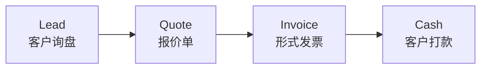

# Ola ERP/CRM — MVP 产品定义（手写笔记整理）

> **来源**: 创始人手写笔记（2 页 FDM 纸质稿）  
> **整理日期**: 2026-03-26  
> **状态**: 待创始人确认

---

## 第一页：前端基础 MVP — 产品定义

### ① 侧边栏导航结构

MVP 版本的侧边栏应包含以下菜单项：

| 菜单项 | 模块状态 | 说明 |
|--------|---------|------|
| Dashboard | ✅ 已有 | 仪表板 |
| Ask Ola | 🔧 需完善 | AI 对话入口 |
| Customer | ✅ 已有 | 客户管理 |
| Factory | ✅ 已有 | 供应商/工厂管理 |
| Merchandise | ✅ 已有 | 商品管理 |
| Quote | ✅ 已有 | 报价单管理 |
| Invoice | ✅ 已有 | 形式发票管理 |
| Purchase Order | ✅ 已有 | 采购单管理 |
| Settings | 🔧 需完善 | 系统设置 |
| Profile | ✅ 已有 | 个人资料 |

### ② 关键功能标注

**① Settings 页面**
- 初期设定：系统的预设初始配置
- 需要有 form 表单来配置系统参数
- 可以做系统级的初始化设置

**② 同期完成**
- 上述所有模块需要在 MVP 阶段同期完成

**③ Email Accounts**
- 设定完成后接入 integration 模块
- 接下来是 integration 接入（邮件系统对接）

**④ Ask Ola**
- General（通用对话模式）
- 需要有 WhatsApp 接入
- 目前暂未完善

### ③ WhatsApp 相关

1. **确定**: 功能的 UI/交互界面需要清晰呈现，特别是 configuration 部分
2. **WhatsApp 接入**: 基础接入已完成，交互需完善，需要展示 score 等数据
3. **WhatsApp 联系人**: 需要将 WhatsApp 联系人同步展示, 导入 9 min（?）内的历史数据

---

## 第二页：MVP 最小可行产品 — 交互定义

### ⑤ MVP 界面与交互

#### 界面线框图

```
┌──────────────────────────────────────────┐
│                 OLA                       │
├──────────────────────────────────────────┤
│          │                               │
│  侧边栏   │        主内容区域              │
│          │                               │
│ ─────── │   ┌─────────────────────────┐  │
│ 无用户   │   │                         │  │
│ 信息状态 │   │      对话/内容区域        │  │
│ ─────── │   │                         │  │
│ 基本入口 │   └─────────────────────────┘  │
│ ─────── │                               │
│ 工程版块 │                               │
│          │                 [Login]       │
└──────────────────────────────────────────┘
```

#### 核心保证项

| 编号 | 要求 | 说明 |
|------|------|------|
| ① | 保证所有现有功能正常运作 | 当前已有的 CRUD 模块必须稳定运行 |
| ② | 保证 AskOla 可以正常运作 | AI 对话功能是 MVP 核心差异化 |

#### AskOla 交互要求

- AskOla 需要具备正常的对话交互能力
- 右侧是消息/对话框界面
- 需要能调用和展示 Comparison（比价单）结果
- 需要有动态内容生成能力

### ⑥ Lead-to-Cash 核心流程



**MVP 必须保证这条核心链路完整可用。**

#### 关键业务流程定义

| 流程 | 描述 |
|------|------|
| **[M] Lead → Quote → Invoice** | OLA 前端要保证交互流程正确，核心 lead-to-cash 闭环 |
| **[N] A** | 客户给出 Quote 报价反馈后的流程 |
| **[N] B** | 通过 menu → Customer → 创建 Quote → 转换为 Invoice |
| **[N] C** | 从 Invoice 生成对应的 Purchase Order（采购单） |
| **OLA 1** | OLA 的前端要保证能够进行数据交互 |
| **OLA 2** | 小程序(menu) + Customer 数据应该在 paste 后自动关联 |
| **OLA 3** | Quote 和 Invoice 之间需要双向关联转换 |
| **OLA 4** | 需要能从 Quote 直接生成对应的 Purchase Order, 以及最终生成 Comparison（利润对比） |

---

## 总结：MVP 核心交付物

> [!IMPORTANT]
> **MVP 的定义是确保核心 Lead-to-Cash 业务闭环完整运作，同时 AskOla AI 对话能力可用。**

### 必须交付

1. **侧边栏完整导航** — 10 个核心菜单项全部可用
2. **CRUD 模块稳定** — Customer / Factory / Merchandise / Quote / Invoice / PO 全部正常
3. **AskOla 对话** — 基础对话 + WhatsApp 接入 + Comparison 调用
4. **Lead-to-Cash 闭环** — Quote → Invoice → PO → Payment → Comparison 全链路
5. **Settings 初始化** — 系统配置表单完成

### 需要确认的问题

> [!WARNING]
> 以下内容从手写笔记中识别，可能存在偏差，请创始人确认：

1. "9 min" — 是指 WhatsApp 联系人导入时间限制（9分钟内完成）还是其他含义？
2. Email Accounts Integration — 是否纳入第一周 sprint？
3. AskOla 的 "General" 模式 — 是否需要真实的 LLM 后端对接，还是先做 UI 骨架？
4. Comparison 调用 — AskOla 中触发 Comparison 的具体交互方式是什么？
5. "paste" 功能 — 指的是贴入客户信息后自动创建/关联 Customer 记录？

---

> **本文档由 AI 从手写笔记中识别整理。请团队核实各项内容的准确性。**
